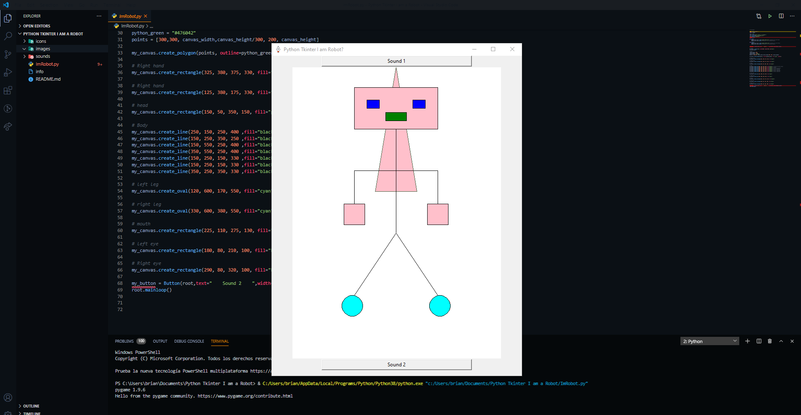

<h2 align="center">I am a Robot &nbsp;🤖&nbsp;</h2>

<p align="center">
  
  <a href="https://github.com/BrianMarquez3/I-am-a-Robot/tags">
    
  </a>
  <a href="https://github.com/BrianMarquez3/I-am-a-Robot/stargazers">
    
  </a>
  <a href="https://github.com/BrianMarquez3/I-am-a-Robot/network">
    
  </a> 
</p>
  
_Install_
```
pip install pygame
```


_Code_
```

from tkinter import *
import pygame

root = Tk()
root.title('Python Tkinter I am Robot?')
root.iconbitmap('icons/pluma.ico')
root.geometry("600x770")
pygame.init()

def play():
    pygame.mixer.music.load("sounds/robot.wav") #Loading File Into Mixer
    pygame.mixer.music.play() #Playing It In The Whole Device

def play2():
    pygame.mixer.music.load("sounds/robot2.wav") #Loading File Into Mixer
    pygame.mixer.music.play() #Playing It In The Whole Device


my_button = Button(root,text="    Sound 1    ",width=50,command=play).pack()

# canvas
my_canvas = Canvas(root, width=500, height=700, bg="white")
my_canvas.pack()

# Heart
canvas_width = 250
canvas_height = 300
python_green = "#476042"
points = [300,300, canvas_width,canvas_height/300, 200, canvas_height]

my_canvas.create_polygon(points, outline=python_green, fill='pink', width=1)

# Right hand
my_canvas.create_rectangle(325, 380, 375, 330, fill="pink") 

# Right hand
my_canvas.create_rectangle(125, 380, 175, 330, fill="pink") 

# head
my_canvas.create_rectangle(150, 50, 350, 150, fill="pink")

# Body
my_canvas.create_line(250, 150, 250, 400 ,fill="black") # Linea Horizontal Rojas
my_canvas.create_line(150, 250, 350, 250 ,fill="black") # hombro  
my_canvas.create_line(150, 550, 250, 400 ,fill="black") # Pierna Izquierda
my_canvas.create_line(350, 550, 250, 400 ,fill="black") # Pierna Derecha
my_canvas.create_line(150, 250, 150, 330 ,fill="black") # Brazo izquierdo
my_canvas.create_line(150, 250, 150, 330 ,fill="black") # Brazo izquierdo
my_canvas.create_line(350, 250, 350, 330 ,fill="black") # Brazo izquierdo

# left leg
my_canvas.create_oval(120, 600, 170, 550, fill="cyan")

# right leg
my_canvas.create_oval(330, 600, 380, 550, fill="cyan")

# mouth
my_canvas.create_rectangle(225, 110, 275, 130, fill="green") 

# left eye
my_canvas.create_rectangle(180, 80, 210, 100, fill="blue")

# Right eye
my_canvas.create_rectangle(290, 80, 320, 100, fill="blue")

my_button = Button(root,text="    Sound 2    ",width=50,command=play2).pack()
root.mainloop()
```
